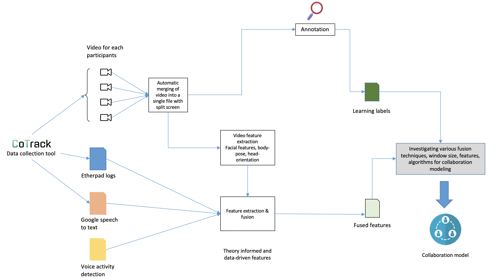

# Predicting collaboration in students using machine learning

This repository contains machine learning codes and data pre-processing scripts used in my second article of Phd. This article is focused on building collaboration predictive models using multimodal data, e.g., audio, video, logs.

An overall idea of this article is presented in below figure.

I am using CoTrack tool to collect data from online collaboration settings. This tool provides various files of students acitivities (e.g., voice activity detection, google speech to text, writing activities, audio/video data). The ultimate goal is to build machine learning models which can predict collaboration in students in classroom settings using CoTrack.

This repository will contain all the scripts and anlaysis code of collaboration modeling.

At the moment, following scripts are available 

1. preprocessing_merge_videos_split_screen.py: This python script takes multiple videos which are stored at different point of time, and create a new video with split screen by synchronising them all.
2. feature_level_fusion.py: This script performs feature-level fusion after extracting features from Etherpad logs, Voice activity detection and speech to text data.